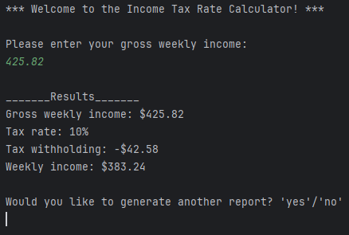

# Income Tax Rate Calculator 
Simple Java program for calculating a user's tax rate given their average weekly gross income.

## Table of Contents
* [General info](#general-info)
* [How to Run](#how-to-run)

## General Info
This program was built for a critical thinking assignment in my **CSC320 - Programming I** course at Colorado State University Global.

In this program, a user enters their average weekly gross income and the program compares the input to several different thresholds to determine the appropriate tax rate to apply to the user's income. Once the correct tax rate has been identified, the program runs a few simple calculations to determine the amount of tax withholding to be subtracted from the user's gross income and what their final take-home weekly income will is after tax withholding is deducted.

The results of these calculations are then compiled into a short report that is printed to the console for the user to view. Users are then confronted with a prompt asking if they would like to generate another report. 



If the user enters 'yes', the program loops back to the beginning and re-prompts them to enter their gross weekly income (this looping structure was used to accommodate for scenarios where a user may need to calculate multiple tax rates for others, or if they simply want to test out different inputs to compare how the totals differentiate). If the user enters 'no', the program ends.

## How to Run
To run this program, simply download the ```incomeTaxRateCalculator.jar``` file under "Releases" and open the Command Prompt.

Once in the Command Prompt, type ```java -jar \path\to\incomeTaxRateCalculator.jar``` to execute the program.

